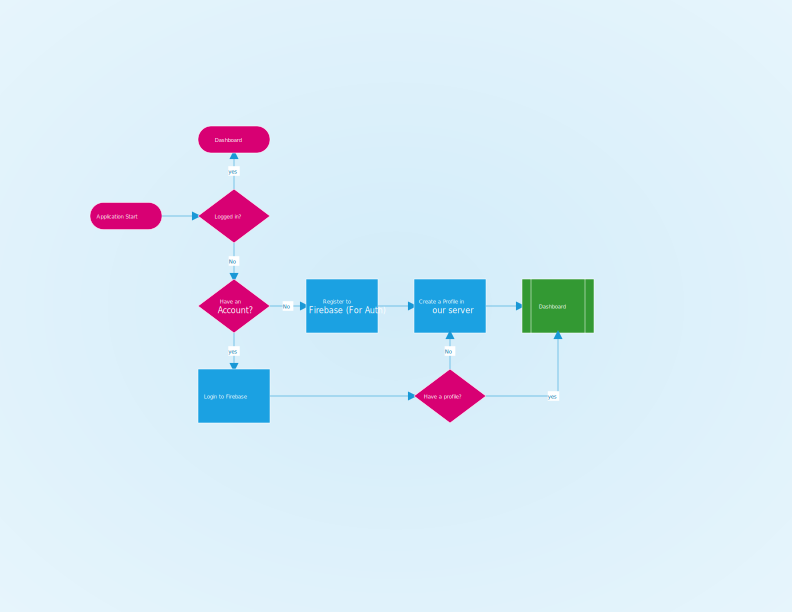
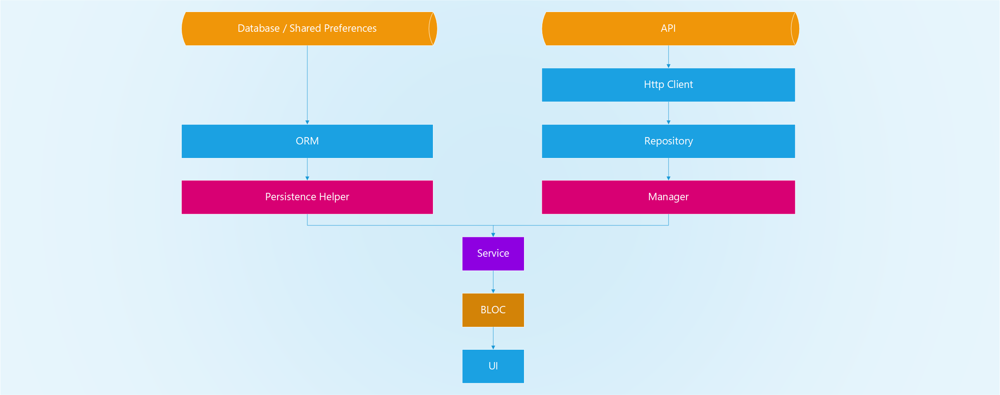
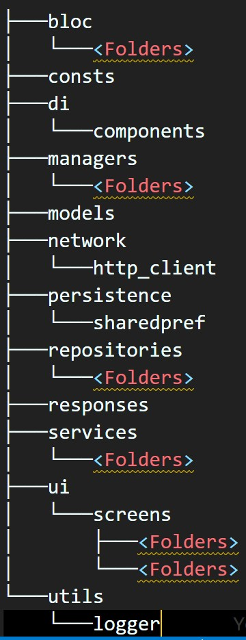

# tourists

Tourists App

## Under Review

### Registration Process

1. Register using Firebase :fire: Finished!
2. Create a Profile (name, location ...) :boy: under process.
3. POST the profile to our server, saving the user for our usage inside our DB.

as you can see we have 3 stages here:

1. Login to Firebase
2. Register to Firebase
3. Create a profile

## Getting Started

This application is an architecture application.

## Design Architect

### API

This is the place the backend is hosted, defined by a URL.

### Http Client

This is the client that connects to the API, it is a singleton, for memory efficiency.

### Repository

This is the place where we execute the commands, it provides the URL from a static file, and uses Http Client.

### Manager

This is the place where we extract info from the Repository.

### Service

This is the place where we extract

### BLOC Managment

State management functions to provide a mitigation for the UI.

### UI

The place where see the final result :)

### Persistence Helper

This is the place where we Cache Data from the API.

### ORM

Mitigation Middle Ground

## Technologies Used

* Sqfentity as an ORM
* Inject:dart as a DI Injector
* Build_Runner as a code generator
* RxDart as a stream, reactive helper.
* MobX as a state manager
* easy_localization as a translation provider

## Structure

### BLOC

State Manger, This is the place where we store state manager.

### Consts

Contains the constants of the App, API URLs included

### DI

Dependency Injection code

### Managers

The place we store managers, each manager is located in a separate folders.

### models

The place we store model files

### Network

Don't change here, Authorization header injection happens here, and it provides a middle ground to connect to the Http Client. this is helpful because we can use this to make a single change that affects the way every single repository works.

### Persistence

A separation layer to connect to Shared Preferences, and SQLite.

### Repositories

This connects to the API and uses the http client to do so.

### Responses

This represents the decoded version of the RAW JSON from the API. Note that a combination of the fields from multiple responses can create a single model that the BLOC consumes.

### Services

The Place where business logic happens.

### UI

The place UI happens :slightly_smiling_face:

### Utils

The place Logging and various helper classes exists.

